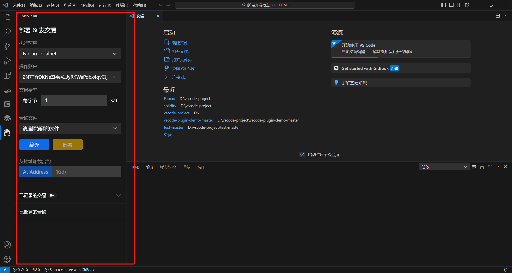

# 开发准备

在本文档中我们将下载安装Visual Studio Code和Fapiao插件，为下一步开发做准备

## install VSCode

下载并安装Visual Studio Code

```bash
https://code.visualstudio.com/
```
## install Fp-Plugin

下载Fp插件

```bash
https://code.visualstudio.com/
```

从本地VSIX安装插件


安装完成后

打开插件，您将看到以下界面

