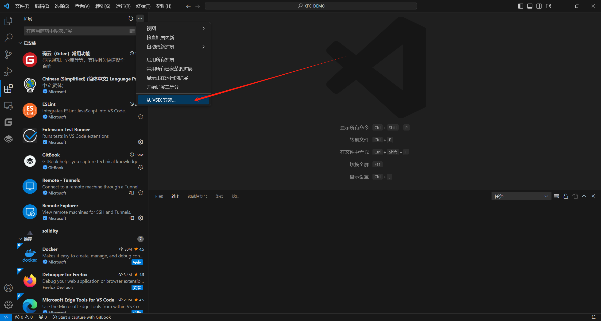

# Development preparation

In this document we will download & install Visual Studio Code and Fapiao plug-ins to prepare for the next development

## install VSCode

Download & Install Visual Studio Code

```bash
https://code.visualstudio.com/
```
## install Fp-Plugin

Download Fp plugin

```bash
https://code.visualstudio.com/
```

Install the downloaded plug-in locally:



After installation is complete

Open the plug-in and you will see the following interface

