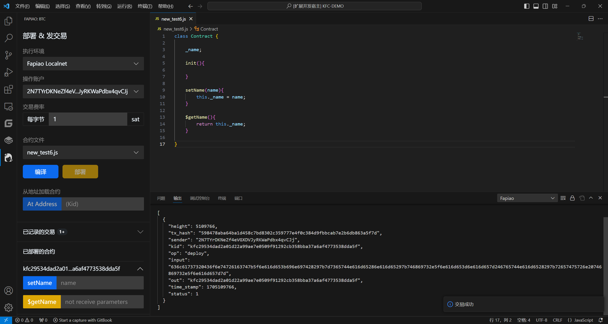
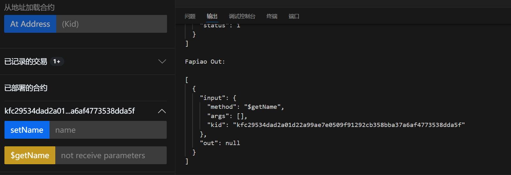
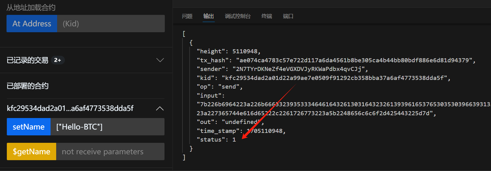
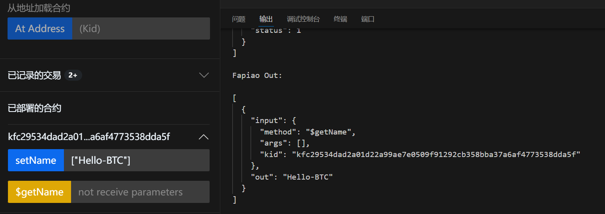

# 第一个合约

接下来我们将使用 **本地测试环境**

创建一个包含 **Get and Set** 函数的合约来读写变量 `name`


## 创建合约

创建一个新的 `new_test6.js` 文件:

```javascript
class Contract {

     _name;

     init(){
        
     }
    
     setName(name){
         this._name = name;
     }
    
     $getName(){
         return this._name;
     }
    
}
```

:::caution

**在Fp协议中，以$开头的函数名是只读函数，_是私有函数，没有任何符号的函数是写函数**

:::


## 部署合约

部署完成后，您将看到以下界面:



## 合约交互

首先，我们第一次调用合约的 `$getName` 函数来获取 `name` 值

如图所示，此时的 `name` 值为空



接下来我们调用合约的 `$setName` 函数并传入 `Hello-BTC`

如图所示，交易成功 `成功状态: 1` `失败状态: 0`



接下来，我们再次调用合约的 `$getName` 函数以获取 `name` 值

如图所示，此时的值已经是我们刚刚传入的 `Hello-BTC`



**你学会了吗?**

让我们更进一步！！！